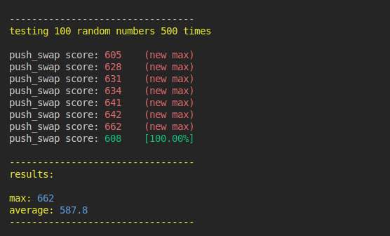

# push swap tester

### features
- this tester will run push_swap `n` time then tell you the max and average number of operation your program took to sort a stack of random values
- a log file (tester.log) is created, it contain for every maximum found the test in order to reproduce the result


## how to use
### installation
clone the repo in your project
```
git clone https://github.com/Maxime-juncker/push_swap_tester.git
```

before running the tester, you may need to changes these variables in `benchmark.sh` based on your needs

`ITERATIONS`: how many times push_swap will be tested

`NB_ARGS`: the size of the stack of random values

`PUSH_SWAP_PATH`: the path of your executable

### using the tester
```
cd push_swap_tester
bash benchmark.sh
```
